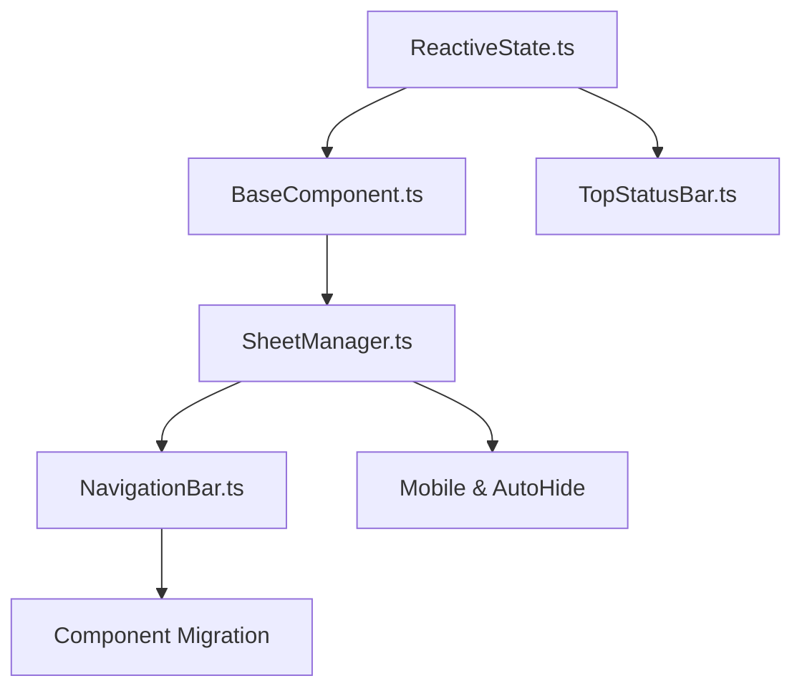
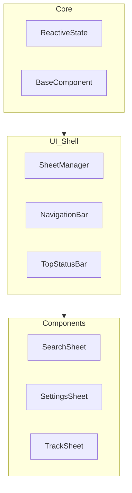

# Plan: SunTrail v5.8 UI Refactor — "Minimalist Alpin" (v3)

## Objective
Break the 700+ line `ui.ts` monolith into a scalable, component-based "Super-App" architecture. Replace floating widgets with a Navigation Bar and Bottom Sheets while introducing reactive state management.

## 🏗 Architecture & Patterns
- **Directory Structure**: 
    - `src/modules/ui/core/`: `BaseComponent.ts`, `SheetManager.ts`, `ReactiveState.ts`.
    - `src/modules/ui/components/`: `NavigationBar.ts`, `SearchSheet.ts`, `SettingsSheet.ts`, `TrackSheet.ts`, `TopStatusBar.ts`.
- **Reactive State (Proxy)**: Wrap `state.ts` in a recursive JS Proxy. Use a microtask-based batching system to prevent UI flickering on rapid updates.
- **Component Lifecycle**: Every UI component must inherit from `BaseComponent` and implement `render()` and `dispose()`.
- **Markup Strategy**: Use HTML `<template>` tags in `index.html`. Components clone these templates and hydrate them.
- **Sheet Exclusivity**: Use a Singleton `SheetManager` to ensure only one bottom sheet is active at a time.
- **Back Button**: Register a Capacitor `backButton` listener with priority 101 to close active sheets before exiting the app.

## 🛠 Tech Stack & Constraints
- **Vanilla TypeScript**: Strict typing. No `any`.
- **CSS Transforms**: Use `translateY(100%)` for hiding sheets (keeps DOM measurable).
- **Glassmorphism**: Cap `backdrop-filter: blur()` at 12px for mobile performance.
- **Validation**: Strict `isNaN` checks on all coordinates before calling `flyTo`.

## 📊 Task Dependency Graph

## ⚡ Parallel Execution Graph

## 🎯 Category + Skills Recommendations
- **Category**: `visual-engineering`
- **Skills**: `frontend-ui-ux`, `threejs-master`, `capacitor-pro`.

## 📝 Work Plan

### Phase 1: Foundation (Reactivity & Base)
1. **src/modules/ui/core/ReactiveState.ts**: Implement `createReactiveState(state)` using a recursive Proxy.
    - **QA Scenario**: 
        - Tool: `vitest`
        - Steps: Create mock state, subscribe to nested property, update it.
        - Result: Listener is called exactly once.
2. **src/modules/state.ts**: Integrate `ReactiveState`.
    - **QA Scenario**:
        - Tool: `bash`
        - Steps: Run `npm test src/modules/state.test.ts`.
        - Result: All tests pass.
3. **src/modules/ui/core/BaseComponent.ts**: Create the base class.
    - **QA Scenario**:
        - Tool: `vitest`
        - Steps: Inherit, mount template, call dispose.
        - Result: Template rendered; listeners cleaned.

### Phase 2: UI Infrastructure (The Shell)
1. **index.html**: Refactor to skeleton + `<template>` tags.
    - **QA Scenario**:
        - Tool: `browser`
        - Steps: Inspect elements.
        - Result: Templates present but hidden.
2. **src/modules/ui/core/SheetManager.ts**: Implement Singleton manager.
    - **QA Scenario**:
        - Tool: `browser`
        - Steps: `SheetManager.open('search')`, then `SheetManager.open('settings')`.
        - Result: Only settings visible.
3. **src/modules/ui/components/NavigationBar.ts**: Implement 4-tab bar.
    - **QA Scenario**:
        - Tool: `browser`
        - Steps: Click "Settings" tab.
        - Result: Tab active; settings sheet opens.
4. **src/modules/ui/components/TopStatusBar.ts**: Implement LOD, Weather, and Stats widgets.
    - **QA Scenario**:
        - Tool: `browser`
        - Steps: Change `state.ZOOM` manually in console.
        - Result: LOD badge updates immediately.

### Phase 3: Component Migration
1. **src/modules/ui/components/SearchSheet.ts**: Extract search logic with NaN validation.
    - **QA Scenario**:
        - Tool: `browser`
        - Steps: Mock NaN coords response.
        - Result: No crash; error toast shown.
2. **src/modules/ui/components/SettingsSheet.ts**: Extract settings and presets.
    - **QA Scenario**:
        - Tool: `browser`
        - Steps: Toggle "Shadows".
        - Result: Light updates; state persists.
3. **src/modules/ui/components/ExpertSheets.ts**: Migrate Weather, Solar, and SOS into Sheets.
    - **QA Scenario**:
        - Tool: `browser`
        - Steps: Open SOS from navigation.
        - Result: SOS data displayed in sheet.

### Phase 4: Refinement
1. **src/modules/ui/autoHide.ts**: Implement 5s Smart Auto-Hide.
    - **QA Scenario**:
        - Tool: `browser`
        - Steps: Wait 5s.
        - Result: UI hides.
2. **src/modules/ui/mobile.ts**: Capacitor Back Button listener.
    - **QA Scenario**:
        - Tool: `browser`
        - Steps: Trigger simulated back button with open sheet.
        - Result: Sheet closes.
3. **src/modules/ui.ts**: Refactor into thin entry point.
    - **QA Scenario**:
        - Tool: `bash`
        - Steps: `npm run check`.
        - Result: Zero errors.

## 🏁 Actionable TODO List for Caller

### Wave 1: Core (Foundation)
- [x] Create `src/modules/ui/core/ReactiveState.ts` — recursive Proxy for state reactivity.
  - Depends: None
  - Blocks: Wave 2
  - Category: `unspecified-high`
  - Skills: `typescript-pro`
  - QA: `vitest` unit test for nested subscription.
- [x] Update `src/modules/state.ts` to use Proxy state.
  - Depends: `ReactiveState.ts`
  - Blocks: Wave 2
  - Category: `unspecified-low`
  - Skills: `typescript-pro`
  - QA: `npm test src/modules/state.test.ts`.
- [x] Create `src/modules/ui/core/BaseComponent.ts` — base class for hydration.
  - Depends: `ReactiveState.ts`
  - Blocks: Wave 2
  - Category: `visual-engineering`
  - Skills: `frontend-ui-ux`
  - QA: `vitest` unit test for `render()` and `dispose()`.

### Wave 2: Shell (Infrastructure)
- [x] Refactor `index.html` to move markup to `<template>` tags.
  - Depends: Wave 1
  - Blocks: Wave 3
  - Category: `visual-engineering`
  - Skills: `frontend-ui-ux`
  - QA: Browser inspection of initial DOM.
- [x] Create `src/modules/ui/core/SheetManager.ts` — singleton sheet controller.
  - Depends: Wave 1
  - Blocks: Wave 3
  - Category: `visual-engineering`
  - Skills: `frontend-ui-ux`
  - QA: Console `SheetManager.open()` test.
- [x] Create `src/modules/ui/components/NavigationBar.ts` — bottom tab bar.
  - Depends: `SheetManager.ts`
  - Blocks: Wave 3
  - Category: `visual-engineering`
  - Skills: `frontend-ui-ux`
  - QA: Click tabs and verify sheet opening.
- [x] Create `src/modules/ui/components/TopStatusBar.ts` — status widgets.
  - Depends: Wave 1
  - Blocks: Wave 3
  - Category: `visual-engineering`
  - Skills: `frontend-ui-ux`
  - QA: Verify real-time zoom updates in widget.

### Wave 3: Components (Migration)
- [x] Create `src/modules/ui/components/SearchSheet.ts` — search migration.
  - Depends: Wave 2
  - Blocks: Wave 4
  - Category: `visual-engineering`
  - Skills: `frontend-ui-ux`, `threejs-master`
  - QA: Mock NaN coords geocode check.
- [x] Create `src/modules/ui/components/SettingsSheet.ts` — settings migration.
  - Depends: Wave 2
  - Blocks: Wave 4
  - Category: `visual-engineering`
  - Skills: `frontend-ui-ux`
  - QA: Toggle shadows and verify Three.js update.
- [x] Create `src/modules/ui/components/ExpertSheets.ts` — Weather/Solar/SOS migration.
  - Depends: Wave 2
  - Blocks: Wave 4
  - Category: `visual-engineering`
  - Skills: `frontend-ui-ux`
  - QA: Verify SOS data rendering in sheet.
- [x] Create `src/modules/ui/components/TrackSheet.ts` — migrate REC/GPX logic.
  - Depends: Wave 2
  - Blocks: Wave 4
  - Category: `visual-engineering`
  - Skills: `frontend-ui-ux`
  - QA: Verify track stats update.

### Wave 4: Polish
- [x] Create `src/modules/ui/autoHide.ts` — 5s cinematic hide.
  - Depends: Wave 2
  - Blocks: Final
  - Category: `visual-engineering`
  - Skills: `frontend-ui-ux`
  - QA: Wait 5s without interaction.
- [x] Create `src/modules/ui/mobile.ts` — Capacitor back button.
  - Depends: `SheetManager.ts`
  - Blocks: Final
  - Category: `visual-engineering`
  - Skills: `capacitor-pro`
  - QA: Simulated back button event.
- [x] Refactor `src/modules/ui.ts` to entry point.
  - Depends: Wave 3
  - Blocks: Final
  - Category: `unspecified-low`
  - Skills: `typescript-pro`
  - QA: `npm run check`.

## 🏁 Final Verification Wave
- [x] **State Sync**: Verify `state.PERFORMANCE_PRESET = 'eco'` updates the UI chip automatically.
- [x] **Z-Index**: Verify `TopStatusBar` is always above `BottomSheet` overlays.
- [x] **Memory**: Verify `component.dispose()` is called when switching views to prevent listener leaks.
- [x] **NaN Safety**: Verify searching for "NaN, NaN" does not crash the camera.
- [x] **Build**: `npm run build` passes.
- [x] **Types**: `npm run check` passes.

Plan corrected by Prometheus. Run `/start-work` to begin.
